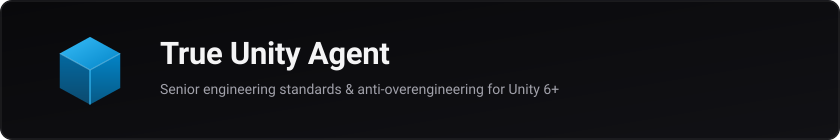

<p align="center">
  
</p>

<h1 align="center">True Unity Agent</h1>

<p align="center">
  <em>Sees your 200-line manager. Writes three lines. Compiles cleanly.</em>
</p>

<p align="center">
  <a href="README_RU.md">Читать на русском</a>
</p>

<p align="center">
  
  
  
  
  
</p>

---

Architecture rules, engineering standards, and checklists for autonomous AI agents (**DeepSeek Harness**, **Claude Code**, **Cursor**, **Windsurf**) in Unity 6+ projects.

Enforces minimal working C# code, mandates root-cause fixes over superficial null checks, and drives the editor safely via the official Unity CLI without corrupting scene or prefab YAML files.

---

## Quickstart

Send this prompt to your AI agent (DSH, Claude Code, Cursor, Windsurf):

```text
Include rules from https://github.com/wssdozh/true-unity-agent into .agents, read START.md, and adapt project context for this repository.
```

The agent will pull the rules, inspect `manifest.json`, detect your stack (URP, Input System, UniTask, DI/ECS), map your `Assets/` layout, and configure `AGENTS.md` autonomously.

*(Or install locally: `.\install.ps1 -TargetPath "C:\Path\To\Project"`)*

---

## Core Standards

- **Root-Cause Fixing (No Crutches)**  
  Masking bugs with blind `if (x != null)` checks across callers or empty `try/catch` blocks is prohibited. Trace issues back through the call stack and resolve them once at the data source.

- **The [Ponytail](https://github.com/dietrichgebert/ponytail) Simplicity Ladder**  
  Occam's razor against overengineering. Solutions are evaluated strictly from the bottom up: YAGNI ➔ existing project classes ➔ C# stdlib (`Mathf`, `Span<T>`) ➔ Unity native API ➔ installed packages ➔ single-line solution ➔ and only then new code. No empty abstractions or single-implementation interfaces.

- **YAML Safety & Unity CLI**  
  Direct text edits on scene (`.unity`), prefab (`.prefab`), and asset files while the editor is running are strictly prohibited. Scene queries, component additions, and baking are executed via `unity command`.

- **95% Layout Fidelity Contract (UI Toolkit)**  
  Two-gate interface workflow: interactive HTML/CSS browser prototype first ➔ human approval ➔ transfer to UXML/USS. Adding unrequested decorative panels, tooltips, or controls not present in the approved design is prohibited.

- **Zero Junk Policy**  
  All project code, scenes, and assets are isolated inside `Assets/_Project/`. Asset naming is standardized (`M_*`, `T_*`, `sfx_*`), and compilation boundaries are enforced with modular `asmdef` files.

---

## Rule Modules (`rules/`)

| Module | Domain | Description |
| :--- | :--- | :--- |
| [`readiness-and-delivery.md`](./rules/readiness-and-delivery.md) | **Workflow** | Feature Gate ($\ge 90\%$), developer interview protocol, autonomous execution, DoD, Cross-Agent Handoff. |
| [`anti-deadlock.md`](./rules/anti-deadlock.md) | **Workflow** | [Ponytail](https://github.com/dietrichgebert/ponytail) ladder, root-cause fixes (No Crutches), 3-attempts rule against infinite loops. |
| [`git-workflow.md`](./rules/git-workflow.md) | **Workflow** | Branching strategy (`feature/*`, `fix/*`), paired `.meta` integrity, English Conventional Commits. |
| [`code-style.md`](./rules/code-style.md) | **Engineering** | Entity-first naming (`playerHealth`), explicit types over `var`, whitespace (Allman braces), UniTask standards. |
| [`architecture-design.md`](./rules/architecture-design.md) | **Engineering** | Factory decoupled from Spawner, Single State Owner, rich domain models, narrow interfaces (ISP), Composition Root. |
| [`unity-best-practices.md`](./rules/unity-best-practices.md) | **Engineering** | Runtime ScriptableObject immutability, prohibition of silent returns, pool reset contracts, Animator view decoupling, `sqrMagnitude`. |
| [`ui-toolkit-pipeline.md`](./rules/ui-toolkit-pipeline.md) | **Tools** | Two-gate UI pipeline (HTML prototype ➔ Unity), 95% layout contract, retained-mode C#. |
| [`unity-cli.md`](./rules/unity-cli.md) | **Tools** | Prohibition of raw text edits on YAML. `unity command` driving, `unity recompile` verification loops. |
| [`project-structure.md`](./rules/project-structure.md) | **Tools** | Zero Junk Policy (`Assets/_Project/`), asset prefixes, assembly isolation via `asmdef`. |

---

## License

[MIT](LICENSE) © [wssdozh](https://github.com/wssdozh)
